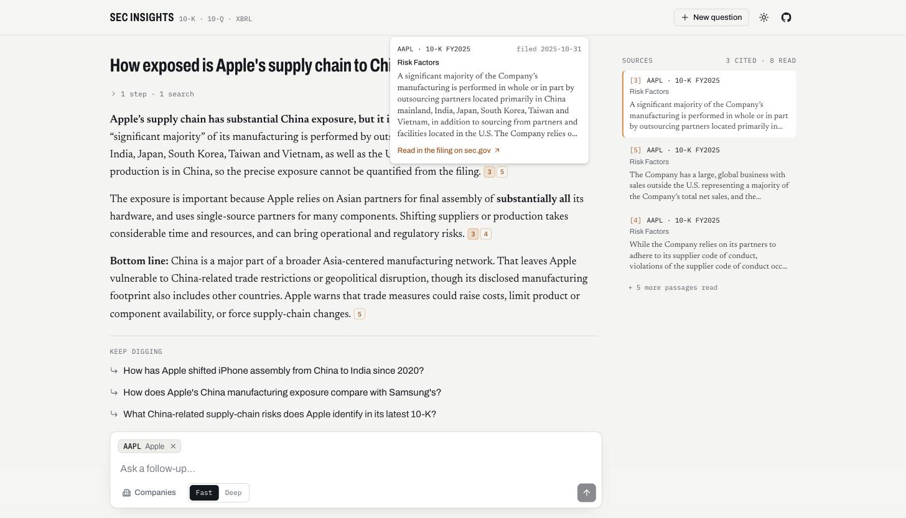
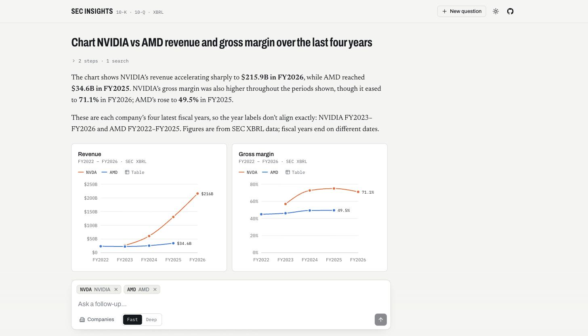
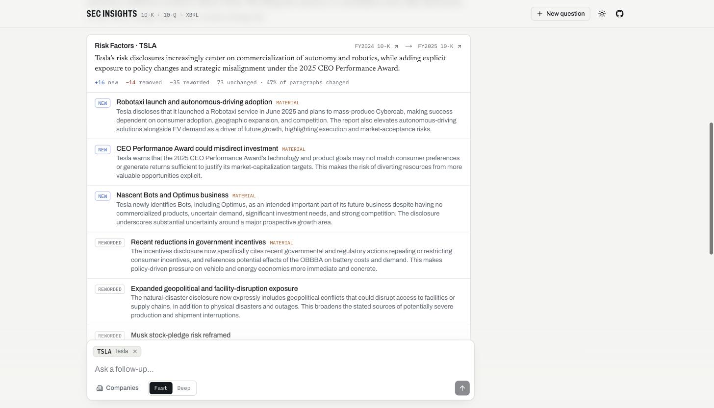
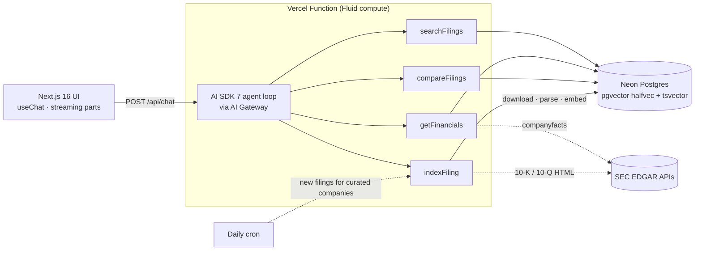

# SEC Insights

**Ask a question about any US public company. Get an answer cited to the exact passage in its 10-K or 10-Q, with reported financials charted straight from XBRL.**



An agentic research assistant over SEC EDGAR. It decides per question whether to search filing text, pull structured financials, index a company it hasn't seen yet, or diff two annual reports, and streams its work as it goes.

## What it does

- **Cited answers.** Every claim links to the filing passage it came from. Hover a `[n]` marker to preview it; click through to sec.gov, where a text fragment scrolls the filing to that passage.
- **Real numbers, charted.** Revenue, margins, EPS, cash flow, R&D, buybacks, and more come from SEC XBRL data rather than from the model. Values are normalized across concept changes and restatements, and quarters are derived from year-to-date filings.
- **Any public company.** Search all ~8,000 SEC filers. Companies that aren't indexed yet get their latest 10-K downloaded, parsed, and embedded on the fly (~15 s), with progress streamed into the answer.
- **"What changed?"** Compares Risk Factors or MD&A across two annual reports and renders the result as a legal-style redline: new, removed, and reworded paragraphs, with the material changes summarized.
- **Live research log.** Each search, data pull, and indexing step appears as it happens.

<table><tr>
<td></td>
<td></td>
</tr></table>

## Architecture

One Next.js app on Vercel. No separate backend, no Docker, no Python.



| Piece | How it works |
|---|---|
| **Filing parser** | Converts EDGAR HTML/iXBRL to text, then splits it into Items. Table-of-contents rows are detected by their trailing page numbers, and the body occurrence of each Item wins. It handles 10-Q Part I/II numbering and filers (e.g. JPMorgan) whose MD&A lives in an annual report appended after Item 15. |
| **Chunking** | Paragraph-aware ~1,400-character chunks with overlap. Each chunk is embedded with a contextual header (company · form · period · section) and keeps a verbatim anchor phrase for `#:~:text=` deep links. |
| **Hybrid retrieval** | Vector search (512-dim `halfvec`; exact scan when filtered to a few companies, HNSW otherwise) plus Postgres full-text search with OR'd terms, fused with Reciprocal Rank Fusion. Multi-company questions are interleaved so each company gets passages. |
| **XBRL normalizer** | Merges concept fallbacks (e.g. `Revenues` → `RevenueFromContract…` → `RevenuesNetOfInterestExpense` for banks). The latest restatement wins, and each period is labeled by the filing that first reported it. Q4 and quarterly cash flows are derived from YTD values; per-share metrics are never derived. |
| **Filing diff** | Exact-match paragraphs are paired first (ignoring years). The rest are embedded and greedily matched by cosine similarity. Trivial edits count as unchanged; low-overlap matches are split into removed + added. The fast model summarizes the material changes, and results are cached. |
| **Guardrails** | Per-visitor and global daily limits in Postgres, prepaid AI Gateway credits as a hard spend ceiling, and starter questions replayed from cache at zero cost. Storage is kept under the free tier with LRU eviction of on-demand companies. |

## Quality

`pnpm eval` runs 17 questions end-to-end through the production route:

| Metric | Score |
|---|---|
| Retrieval hit@8 (right company + section + keyword) | 100% (10/10) |
| Tool choice | 100% (17/17) |
| Citation validity (every `[n]` exists) | 100% (10/10) |
| Numeric accuracy vs XBRL (±1%) | 100% (6/6) |
| Faithfulness (LLM judge, cited claims supported) | 91% |
| Median latency | 9.6 s |

Full per-case results are in [`evals/results.md`](evals/results.md). There are also 40 unit tests covering the parser, chunker, fiscal-period math, XBRL normalization, fusion, diff alignment, and citation handling, plus live tests that parse real Apple, Tesla, and JPMorgan 10-Ks from EDGAR.

## Cost

Built to run for about $0/month fixed:

| | |
|---|---|
| Hosting | Vercel Hobby: $0 |
| Database | Neon Free (0.5 GB): $0; ~12 companies × 3 filings ≈ 75 MB |
| SEC data | EDGAR + XBRL APIs: $0 |
| Chat model | `openai/gpt-6-luna` through AI Gateway: ≈ $0.002 per question |
| Embeddings | `text-embedding-3-small` @ 512 dims: ≈ $0.002 per 10-K indexed |

Models are environment variables, so any AI Gateway model can be swapped in. **Deep** mode uses a stronger model for harder questions, with a stricter daily limit.

## Stack

Next.js 16 (App Router, Turbopack) · React 19 · TypeScript · AI SDK 7 · Vercel AI Gateway · Neon Postgres + pgvector · Drizzle ORM · Tailwind CSS 4 · shadcn/ui · Recharts · Streamdown · Vitest · Biome

## Run it locally

Requires Node 24 (see `.nvmrc`), pnpm, and a Vercel account.

```bash
pnpm install
vercel link                              # or create a new project
vercel integration add neon              # free Postgres; adds DATABASE_URL
vercel env pull .env.local               # DATABASE_URL + VERCEL_OIDC_TOKEN for AI Gateway
echo "SEC_EMAIL_ADDRESS=you@example.com" >> .env.local   # SEC requires a contact email

pnpm db:migrate
pnpm seed                # ticker list + curated companies (~3 min)
pnpm cache:featured      # pre-compute the starter questions
pnpm dev
```

| Script | |
|---|---|
| `pnpm seed [TICKER…]` | Load the SEC ticker list and index filings + financials |
| `pnpm cache:featured` | Pre-compute starter-question answers |
| `pnpm eval` | Run the eval suite and write `evals/results.md` |
| `pnpm test` / `pnpm test:live` | Unit tests / plus live SEC parsing tests |
| `pnpm lint` · `pnpm typecheck` · `pnpm build` | What CI runs |

## Project layout

```
app/api/chat           agent route: tools, streaming, follow-up suggestions, rate limits
app/api/cron/refresh   daily: new filings for curated companies, ticker refresh
components/chat        home, composer, turns, research log, company picker
components/citations   inline markers + margin notes
components/charts      XBRL small-multiple charts
components/diff        redline card
lib/sec                EDGAR client, HTML→text, section splitter, chunker, XBRL normalizer
lib/ingest             ingestion pipeline + storage eviction
lib/retrieval          hybrid search + rank fusion
lib/diff               paragraph alignment + comparison
lib/ai                 models, prompts, tools
scripts                seed, cache-featured, eval
```

---

This started as a take-home prototype built on FastAPI, LangChain, ChromaDB, and Docker, and was rebuilt as a single deployable Next.js app. The original is in the git history.
